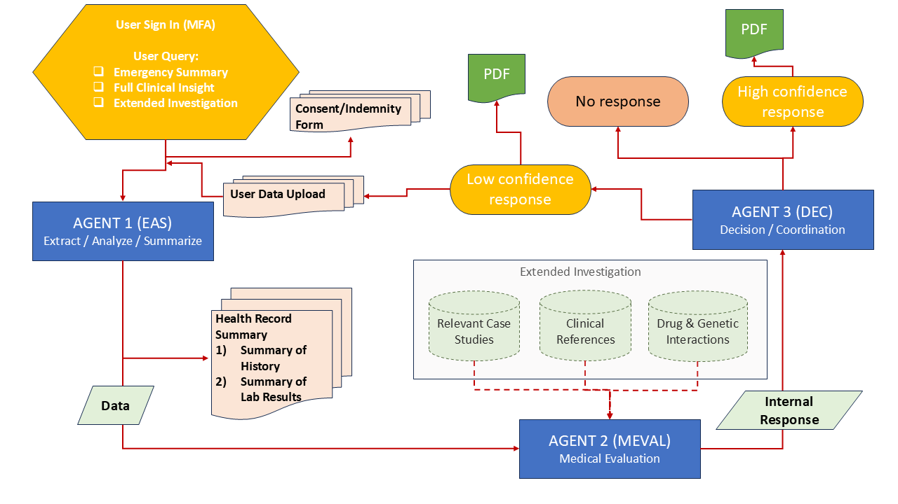

# 🏥 MediGuard: Multi-Agent Medical Analysis System using GenAI AgentOS

> Made with ❤️ by the **Hackathon Dream Team – LeadWith AIAgents (GenAI Community)**  
> 📫 Contact us: HackathonDreamTeam@rockingwoldtechnologies.com

---

## 🧩 Project Description

**MediGuard** is a secure, multi-agent medical AI system built on [GenAI AgentOS](https://github.com/genai-works-org/getting-started-genai-agentos).  
It uses AI-powered agents to extract, summarize, evaluate, and coordinate responses for healthcare data such as medical reports, lab results, and scanned PDFs.

---

## 🚑 Real-Life Problem

Doctors often receive lengthy, unstructured patient reports, making it difficult to:
- Understand urgent risks instantly
- Prioritize patients
- Coordinate care across systems

---

## 💡 Our Solution

MediGuard deploys **three AI agents** that:
- 🧠 Extract and summarize reports
- ⚖️ Evaluate clinical context and confidence
- 🤝 Coordinate decisions and next actions

Each agent operates independently but communicates via secure, session-bound messages.

---

## 🔄 Multi-Agent Architecture




---

## 🔄 Multi-Agent Architecture

This diagram explains how the agents (EAS → MEVAL → DEC) interact with each other and handle responses based on medical data analysis and confidence scoring.


---

## 🤖 Agent Responsibilities

### ✅ Agent 1 – `EASAgent` (`llamaindex_file_chat`)
- Accepts file uploads (PDFs, DOCs, images)
- Extracts text using LlamaParse or fallback OCR
- Generates:
  - Emergency summary
  - Mid-level clinical summary
  - Full structured report
- Forwards output to MEVALAgent

> ℹ️ Uses OpenAI GPT-4o + LlamaIndex  
> 🔑 Requires API key from https://cloud.llamaindex.ai/

---

### ✅ Agent 2 – `MEVALAgent`
- Evaluates health summaries from EAS
- Calculates confidence score
- Triggers internal lookup if confidence is low
- Provides actionable advice to DEC agent

---

### ✅ Agent 3 – `DECAgent`
- Makes final decision:
  - High confidence → PDF summary response
  - Low confidence → re-investigation / no response
- Coordinates next steps or alerts

---

## ⚙️ How to Run Locally

### 📦 Prerequisites

Ensure the following are installed:
- Python 3.10+
- Docker
- Git
- `uv` (optional, recommended for agent CLI)

---

### 1️⃣ Clone the Repository

```bash
git clone https://github.com/MotsimAslam/MedContextAI.git
cd genai-agentos
```

---

### 2️⃣ Setup Python Virtual Environment

```bash
python -m venv .venv
.venv\Scripts\activate     # On Windows
# OR
source .venv/bin/activate    # On macOS/Linux
```

---

### 3️⃣ Install Dependencies

```bash
pip install -r requirements.txt
```

---

### 🐳 Run the Platform Locally

Make sure Docker is running, then:

```bash
docker-compose up --build
```

---

## 🧠 Create and Use Your Agent (CLI Workflow)

### 👤 Create a User

```bash
python cli.py signup -u yourusername
# You'll be prompted for a password
```

---

### 🔐 Login

```bash
python cli.py login -u yourusername -p yourpassword
```

---

### 📝 Register an Agent

```bash
python cli.py register_agent --name easagent --description "Extracts and summarizes health record data"
```

This creates a new agent script inside the `cli/agents/` folder.

---

### 🔄 Sync and Deploy Your Agent

```bash
uv sync
uv sync --active
uv run easagent.py
```

After registration, a JWT token will be auto-generated in the new agent file. Copy it into your working agent code to authorize it.

Then re-sync and run:

```bash
uv sync --active
uv run llamaindex_file_chat.py
```

> You can now test your agent at: [http://localhost:3000](http://localhost:3000)

---

## 📥 Upload Medical Reports

1. Sign in on the GenAI UI
2. Choose agent `llamaindex_file_chat`
3. Upload a PDF/image/text file
4. Select your preferred summary type:
   - Emergency Summary
   - Full Clinical Insight
   - Extended Investigation

---

## 📚 Required Libraries

```
llama-index
llama-parse
openai
pdfplumber
pytesseract
Pillow
reportlab
python-dotenv
genai-agentos
```

---

## 🔐 API Setup (LlamaIndex)

If you're using `llamaindex_file_chat`, you’ll need a LlamaParse API key:  
📎 https://cloud.llamaindex.ai/

---

## 🛡 Disclaimer

> ⚠️ This project is for research and prototyping only.  
> It is not intended for direct clinical decision-making.  
> Always consult licensed professionals.

---

## 📦 This Repository Has Been Submitted

This repo is a submitted GenAI Hackathon project.

✅ Built and tested on GenAI AgentOS  
✅ Docker-compatible  
✅ Works with uploaded PDF/image health records

---

## ❤️ Made With Love

By **Hackathon Dream Team – LeadWith AIAgents (GenAI Community)**  
📫 Contact us: HackathonDreamTeam@rockingwoldtechnologies.com

---

## 📚 Reference Example

🧩 For guidance on the GenAI AgentOS structure and CLI usage, check the official GenAI sample repository:

👉 [https://github.com/genai-works-org/getting-started-genai-agentos](https://github.com/genai-works-org/getting-started-genai-agentos)

---
# 🧑‍💻 Hackathon Dream Team


## Meet the Team

This diverse and talented team of professionals came together during the hackathon to develop cutting-edge AI solutions. With expertise spanning AI research, ML engineering, data science, compliance, product architecture, and program management, this dream team was built to innovate.

### Team Members

- **Sean Krepp**  
  *Product / Program*  
  Formerly at Google Data / AI  

- **Yehya Karout**  
  *Architect / Tech Program Manager*  
  Formerly at Deloitte Cyber / AI
  
- **Motsim Aslam**  
  *AI/ ML & Gen AI Developer / Data Scientist*  
  Red Wireless & Beta Ambassador  

- **Dr. Chantal Spleiss**  
  *Architect / Product / Compliance*  
  AI Strategist, Author & Speaker  

- **Nathan Ekanem**  
  *AI Researcher / Strategist*  
  Northern Gas Net / Ipsos MORI  

- **Obaid Ullah Safi**  
  *Developer / AI/ML Engineer*   

- **Carrie Smith**  
  *AI Coding Sleeper*  
  Formerly at GM & JP Morgan Chase
  
- **Umar Mazhar**  
  *AI Researcher / Developer / ML Engineer* 

---

## 👥 Collaboration and Innovation

Each team member brought their unique strengths to the table, making this collaboration not only effective but also inspiring. Together, we tackled real-world AI challenges and built solutions that matter.

---
## 🛠️ Important: Register Your Agent Using This Repo

After cloning our repo, you must:

1. Register the agent using the GenAI AgentOS CLI.  
   This will create a new agent directory and generate a unique **JWT token**.

2. Copy that JWT token and replace it in your agent’s original source file (like `llamaindex_file_chat.py`) inside our repo.

```python
# Example:
AGENT_JWT = "your-new-generated-jwt-token"
```

3. Copy the new generated agent Python file code and replace your existing agent's code with it if changes exist.

4. Run the following to sync and deploy:

```bash
uv sync --active
uv run llamaindex_file_chat.py
```

Now your agent is live on the GenAI platform and accessible at:
👉 [http://localhost:3000](http://localhost:3000)

---

---

# Credit Goes To
--------------------------------------------------------------------
# 🐍 GenAI Agents Infrastructure

This repository provides the complete infrastructure for running GenAI agents, including:

* Backend
* Router
* Master Agents
* PostgreSQL Database
* Frontend
* CLI
* Redis
* Celery

## 📎 Repository Link

👉 [GitHub Repository](https://github.com/genai-works-org/genai-agentos)

## 🛠️ Readme Files

* [CLI](cli/README.md)
* [Backend](backend/README.md)
* [Master Agents](master-agent/README.md)
* [Router](router/README.md)
* [Frontend](frontend/README.md)

## 📄️ License
* [MIT](LICENSE)


## 🧠 Supported Agent Types

The system supports multiple kinds of Agents:

| Agent Type       | Description                                                                                   |
|------------------|-----------------------------------------------------------------------------------------------|
| **GenAI Agents** | Connected via [`genai-protocol`](https://pypi.org/project/genai-protocol/) library interface. |
| **MCP Servers**  | MCP (Model Context Protocol) servers can be added by pasting their URL in the UI.             |
| **A2A Servers**  | A2A (Agent to Agent Protocol) servers can be added by pasting their URL in the UI.            |

---

## 📦 Prerequisites

Make sure you have the following installed:

* [Docker](https://www.docker.com/)
* [Docker Compose](https://docs.docker.com/compose/)
* [`make`](https://www.gnu.org/software/make/) (optional)

  * macOS: `brew install make`
  * Linux: `sudo apt-get install make`

## 🚀 Local Setup

1. Clone the repository:

   ```bash
   git clone https://github.com/genai-works-org/genai-agentos.git
   cd genai-agentos/
   ```

2. Create a `.env` file by copying the example (can be empty and customized later):

   ```bash
   cp .env-example .env
   ```

   * A `.env` file **should be present** for configuration.
   * All variables in `.env-example` are commented.
     You can customize any environment setting by **uncommenting** the relevant line and providing a new value.

3. Start Docker desktop and ensure it is running.

4. Start the infrastructure:

   ```bash
   make up
   # or alternatively
   docker compose up
   ```

5. After startup:

   * Frontend UI: [http://localhost:3000/](http://localhost:3000/)
   * Swagger API Docs: [http://localhost:8000/docs#/](http://localhost:8000/docs#/)

## 👾 Supported Providers and Models
* OpenAI: gpt-4o

## 🌐 Ngrok Setup (Optional)

Ngrok can be used to expose the local WebSocket endpoint.

1. Install Ngrok:

   * macOS (Homebrew): `brew install ngrok/ngrok/ngrok`
   * Linux: `sudo snap install ngrok`

2. Authenticate Ngrok:

   * Sign up or log in at [ngrok dashboard](https://dashboard.ngrok.com).
   * Go to the **"Your Authtoken"** section and copy the token.
   * Run the command:

     ```bash
     ngrok config add-authtoken <YOUR_AUTH_TOKEN>
     ```

3. Start a tunnel to local port 8080:

   ```bash
   ngrok http 8080
   ```

4. Copy the generated WebSocket URL and update the `ws_url` field in:

   ```
   genai_session.session.GenAISession
   ```

---

## 🤖GenAI Agent registration quick start (For more data check [CLI](cli/README.md))
```bash
cd cli/

python cli.py signup -u <username> # Register a new user, also available in [UI](http://localhost:3000/)

python cli.py login -u <username> -p <password> # Login to the system, get JWT user token

python cli.py register_agent --name <agent_name> --description <agent_description>

cd agents/

# Run the agent
uv run python <agent_name>.py # or alternatively 
python <agent_name>.py 
```

## 💎 Environment Variables

| Variable                    | Description                                                          | Example / Default                                                                       |
|-----------------------------|----------------------------------------------------------------------|-----------------------------------------------------------------------------------------|
| `FRONTEND_PORT`             | Port to start a frontend                                             | `3000` - default. Can be changed by run in terminal ` source FRONTEND_PORT=<your_port>` |
| `ROUTER_WS_URL`             | WebSocket URL for the `router` container                             | `ws://genai-router:8080/ws` - host is either `localhost` or `router` container name     |
| `SECRET_KEY`                | Secret key for cryptographic operations - JWT/ LLM config encryption | `$(openssl rand -hex 32)`                                                               |
| `POSTGRES_HOST`             | PostgreSQL Host                                                      | `genai-postgres`                                                                        |
| `POSTGRES_USER`             | PostgreSQL Username                                                  | `postgres`                                                                              |
| `POSTGRES_PASSWORD`         | PostgreSQL Password                                                  | `postgres`                                                                              |
| `POSTGRES_DB`               | PostgreSQL Database Name                                             | `postgres`                                                                              |
| `POSTGRES_PORT`             | PostgreSQL Port                                                      | `5432`                                                                                  |
| `DEBUG`                     | Enable/disable debug mode - Server/ ORM logging                      | `True` / `False`                                                                        |
| `MASTER_AGENT_API_KEY`      | API key for the Master Agent - internal identifier                   | `e1adc3d8-fca1-40b2-b90a-7b48290f2d6a::master_server_ml`                                |
| `MASTER_BE_API_KEY`         | API key for the Master Backend - internal identifier                 | `7a3fd399-3e48-46a0-ab7c-0eaf38020283::master_server_be`                                |
| `BACKEND_CORS_ORIGINS`      | Allowed CORS origins for the `backend`                               | `["*"]`, `["http://localhost"]`                                                         |
| `DEFAULT_FILES_FOLDER_NAME` | Default folder for file storage - Docker file volume path            | `/files`                                                                                |
| `CLI_BACKEND_ORIGIN_URL`    | `backend` URL for CLI access                                         | `http://localhost:8000`                                                                 |

## 🛠️ Troubleshooting

### ❓ MCP server or A2A card URL could not be accessed by the genai-backend
✅ If your MCP server or A2A card is hosted on your local machine, make sure to change the host name from `http://localhost:<your_port>` to `http://host.docker.internal:<your_port>` and try again.

🔎 **Also make sure to pass the full url of your MCP server or A2A card, such as - `http://host.docker.internal:8000/mcp` for MCP or `http://host.docker.internal:10002` for A2A**

⚠️ No need to specify `/.well-known/agent.json` for your A2A card as `genai-backend` will do it for you!

### ❓ My MCP server with valid host cannot be accessed by the genai-backend 
✅ Make sure your MCP server supports `streamable-http` protocol and is remotely accessible.Also make sure that you're specifiying full URL of your server, like - `http://host.docker.internal:8000/mcp`

⚠️ Side note: `sse` protocol is officially deprecated by MCP protocol devs, `stdio` protocol is not supported yet, but stay tuned for future announcements!
